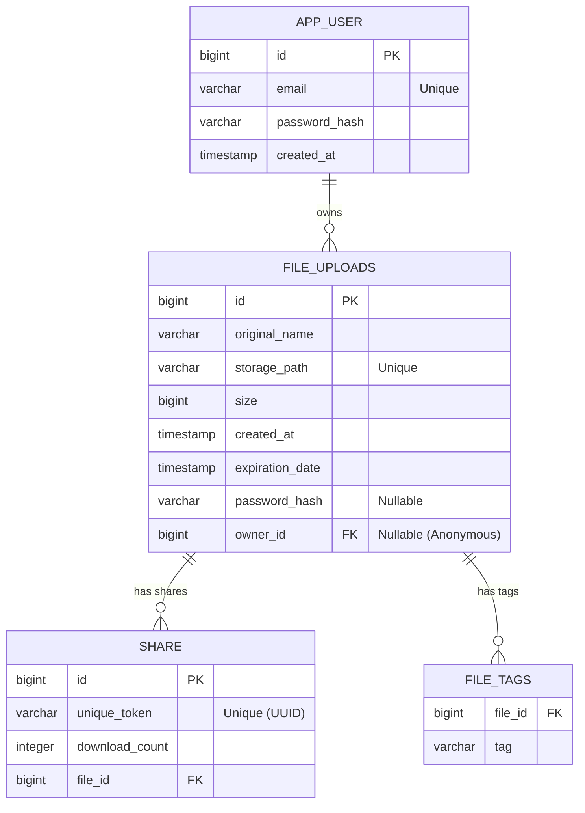

# Documentation Base de Données (PostgreSQL)

## Modèle Logique de Données (MLD)

## Description des Tables

### 1. `app_user`
Table stockant les utilisateurs enregistrés.
- **id** : Clé primaire auto-incrémentée.
- **email** : Identifiant unique de connexion.
- **password_hash** : Mot de passe haché (BCrypt).
- **created_at** : Date d'inscription.

### 2. `file_uploads`
Table principale stockant les métadonnées des fichiers.
*Note : Renommée depuis `file` pour éviter les conflits avec le mot-clé SQL.*
- **id** : Clé primaire.
- **original_name** : Nom d'origine du fichier (ex: `photo.jpg`).
- **storage_path** : Nom unique sur le disque (UUID ou Timestamp + Nom).
- **size** : Taille en octets.
- **created_at** : Date d'upload.
- **expiration_date** : Date de suppression planifiée (Max 7 jours).
- **password_hash** : (Optionnel) Hash du mot de passe de protection du fichier.
- **owner_id** : (FK) Référence vers `app_user`. `NULL` si upload anonyme.

### 3. `share`
Table gérant les liens de partage publics.
- **id** : Clé primaire.
- **unique_token** : UUID v4 unique utilisé dans l'URL de partage.
- **download_count** : Compteur de téléchargements.
- **file_id** : (FK) Référence vers le fichier partagé.

### 4. `file_tags`
Table de jointure (Collection) pour les tags associés aux fichiers.
- **file_id** : (FK) Référence vers le fichier.
- **tag** : Libellé du tag (max 30 caractères).
