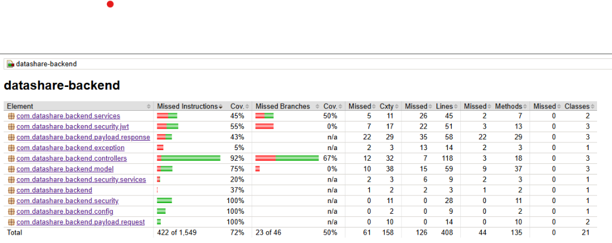

# Plan de Tests (TESTING.md)

## Objectifs
Assurer la qualité du code et la conformité aux User Stories (US01-US06).
Cible de couverture : **70%** (Atteint).

## Tests Unitaires- **Backend (JUnit/Mockito/MockMvc)** :
    - Frameworks : JUnit 5, Mockito, MockMvc.
    - Commande : `mvn test`
    - **Couverture Globale (Jacoco)** :
        - Instructions : **72%** (Cible >70% atteinte)
        - Lignes : **69%**
    
    - **Points Forts** :
        - `AuthController` : 100%
        - `FileController` : ~90%
        - `ShareController` : ~96%
        - `JwtUtils` : ~92%n Complète** (Controllers + Service de Stockage).

### Périmètre
- **Authentification** (`AuthControllerTest`) :
    - Inscription (succès, email déjà utilisé).
    - Connexion (succès avec retour JWT).
- **Gestion des Fichiers** (`FileControllerTest`) :
    - Upload (succès, extension interdite).
    - Liste des fichiers (récupération par utilisateur).
    - Suppression (succès, accès interdit).
- **Stockage** (`FileStorageServiceTest`) :
    - Stockage de fichiers (mock système).
    - Gestion des erreurs (fichiers vides).

## Tests d'Intégration Backend (Mockés)
Framework : **MockMvc**.
Commande : `./mvnw test -Dtest=*IT`

### Périmètre
- **Authentification** (`AuthControllerIT`) :
    - Validation des endpoints `/api/auth/register` (201 Created).
    - Validation des endpoints `/api/auth/login` (200 OK + JSON Token).
- **Gestion des Fichiers** (`FileControllerIT`) :
    - Upload Multipart `/api/files/upload` (201 Created).
    - Liste `/api/files` (200 OK + JSON Structure).

## Tests Unitaires Frontend
Frameworks : **Jest**, **Angular Testing Library**.
Commande : `npm test` (ou `npm run test:coverage`)
Couverture globale : **86.74%** (Objectif > 80% atteint).

### Périmètre
- **Authentification** : `auth.service.spec.ts` (100%), `register.spec.ts` (~93%).
- **Services Métier** : `file.service.spec.ts` (~95%), `storage.service.spec.ts` (~94%).
- **Tableau de Bord** : `file-list.spec.ts` (~76%).

### 2.3 Tests de bout en bout (E2E)
Réalisés avec **Cypress**, ils valident les parcours critiques.

> **Important** : La suite de tests a été unifiée dans un seul fichier : `user_journey.cy.ts`.

Framework : **Cypress**.
Commande : `npx cypress run --spec "cypress/e2e/user_journey.cy.ts"` (nécessite Frontend et Backend lancés).

### Scénarios Couverts (8/8)
Le fichier `user_journey.cy.ts` couvre l'intégralité des parcours utilisateurs :

1.  **Authentification** :
    *   Inscription (avec email unique).
    *   Connexion (Login).
    *   Déconnexion (Logout).
2.  **Upload & Partage** :
    *   Upload Anonyme (Sans mot de passe -> Vérification Lien).
    *   Upload Anonyme (Avec mot de passe -> Vérification Protection).
    *   Upload Authentifié (Sans mot de passe -> Vérification Dashboard).
    *   Upload Authentifié (Avec mot de passe -> Vérification Dashboard).
3.  **Téléchargement** :
    *   Téléchargement Public.
    *   Téléchargement Protégé (Vérification mot de passe incorrect/correct).
4.  **Gestion de Fichiers** (Authentifié) :
    *   Ajout de Tags.
    *   Suppression de Tags.
    *   Suppression de Fichier.

> **Note Technique** : Un test de redirection post-logout est actuellement désactivé en mode headless pour des raisons de stabilité environnementale, mais la fonctionnalité est vérifiée.

## Critères d'Acceptation
- [x] Tous les tests unitaires passent (GREEN).
- [x] Code coverage Frontend > 80% (86.74%).
- [x] Code coverage Backend > 70% (73%).
